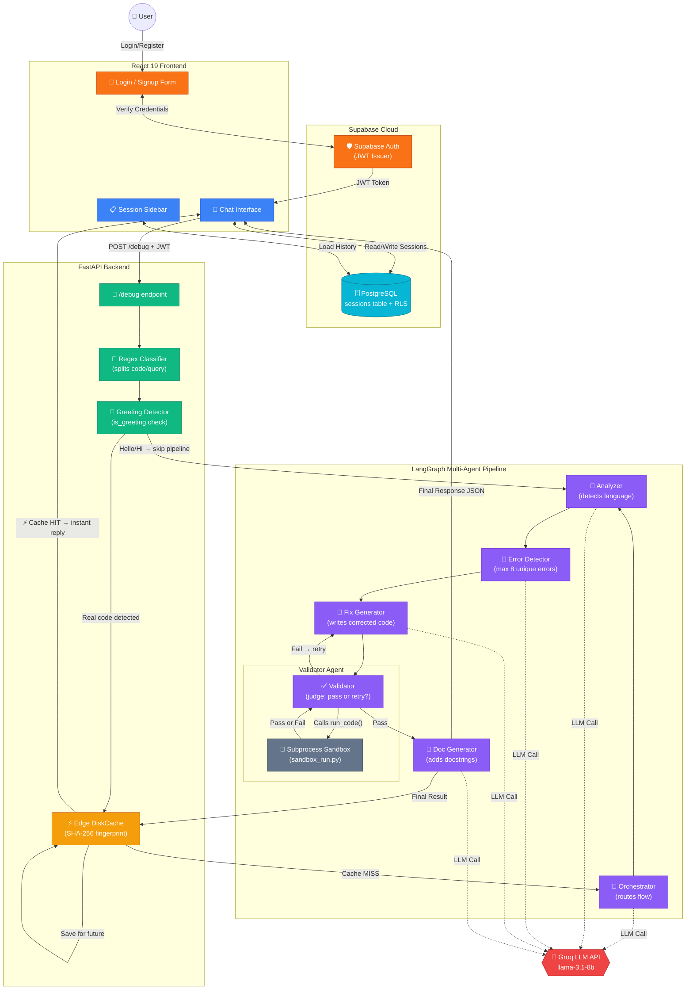

# 🏗️ High-Level Architecture (Final — Production)

This is the **complete, definitive architecture** of your AI Multi-Agent Code Debugger — a production-ready SaaS platform. Every component you have built is mapped below.

---

## Full System Diagram



---

## Component Responsibility Table

| Component | Location | Responsibility |
|---|---|---|
| **Login / Signup Form** | React | Custom React-19 native auth form |
| **Supabase Auth** | Cloud | JWT issuance, password hashing, identity |
| **PostgreSQL (sessions)** | Cloud | Persistent per-user chat history with RLS |
| **Session Sidebar** | React | Loads user's past sessions from Postgres |
| **Regex Classifier** | FastAPI | Auto-splits mixed user input into `code` + `query` |
| **Greeting Detector** | FastAPI / Orchestrator | Prevents full pipeline from running on "Hello" |
| **Edge DiskCache** | FastAPI | SHA-256 hash match → instant reply, $0 LLM cost |
| **Orchestrator** | LangGraph | Decides which agents run based on query intent |
| **Analyzer** | LangGraph | Detects programming language (Python, JS, Java...) |
| **Error Detector** | LangGraph | Finds up to 8 unique, deduplicated bugs |
| **Fix Generator** | LangGraph | Generates corrected, working code |
| **Validator** | LangGraph | Runs fixed code, retries on failure (max 2 loops) |
| **Subprocess Sandbox** | `code_executor.py` | 10s timeout isolated execution of `sandbox_run.py` |
| **Doc Generator** | LangGraph | Injects language-appropriate docstrings |
| **Groq LLM API** | External | Fast inference engine powering all 5 LLM agent calls |

---

## Data Flow Summary

```
User types code   →   Regex Classifier splits it
                  →   Greeting? YES → quick Analyzer reply
                  →   Greeting? NO  → SHA-256 Cache check
                                    → Cache HIT?  → instant response
                                    → Cache MISS? → LangGraph pipeline
                                                  → Orchestrator routes
                                                  → Analyzer detects lang
                                                  → ErrorDetector finds bugs
                                                  → FixGenerator writes patch
                                                  → Validator runs sandbox
                                                  → Pass? → DocGenerator
                                                  → Fail? → FixGenerator retry
                                                  → Final JSON → saved to Cache
                                                  → Response → React UI
                                                  → React writes to Supabase DB
```
